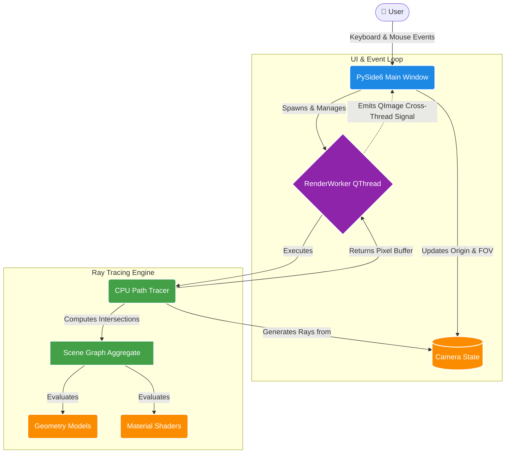

<div align="center">
  
# Rendering Laboratory

**A Python-based Interactive Path Tracing Engine**


</div>

---

## 🌟 Overview

**Rendering Laboratory** is a completely modular, CPU-based path-tracing engine written entirely in Python. It provides a highly extensible object-oriented architecture designed for experimenting with advanced computer graphics, geometric intersections, physically-based materials, and dynamic ray tracing.

## ✨ Features

- **Physically-Based Path Tracing**: Accurate light bouncing, diffuse scattering (Lambertian), and metallic reflections.
- **Interactive Camera System**: Navigate the 3D scene in real-time using asynchronous rendering.
- **Dynamic Quality Scaling**: Automatically drops to a fast 1-sample preview during movement and seamlessly resolves to a high-quality multi-sampled image when idle.
- **Modular Architecture**: Built with robust Factory and Builder design patterns, making it trivial to add new geometries, materials, and engine components.
- **Multi-threaded GUI**: A responsive PySide6 UI that leverages `QThread` to prevent UI freezing during intensive mathematical computations.

## 🏗️ Engine Architecture

Rendering Laboratory strictly separates the User Interface, Scene Construction, and the Rendering Engine to maintain clean dependencies. The interactive event flow and data pipeline are visualized below:



## 🚀 Getting Started

### Prerequisites
- Python 3.8+
- [NumPy](https://numpy.org/) (for accelerated matrix and vector math)
- [PySide6](https://doc.qt.io/qtforpython-6/) (for the GUI and threading)

### Running the Engine
Simply launch the engine by running the main module:
```bash
python main.py
```

### Controls
Once the engine has booted, you can explore the scene:
- `W` - Move Camera Forward
- `S` - Move Camera Backward
- `A` - Strafe Camera Left
- `D` - Strafe Camera Right
- `Mouse Scroll Wheel` - Dynamically adjust the Field of View (Zoom)

## 🛠️ Extending the Engine

Because of the Factory-based architecture, extending the engine is straightforward.

**To add a new shape:**
1. Create a new class inheriting from `Intersectable` in `renderlab.geometry.services`.
2. Implement the mathematical ray-intersection logic in the `intersect()` method.
3. Register your new shape in the `GeometryFactory` (`renderlab.geometry.factories`).
4. Apply any existing `Material` to your new shape and render!
